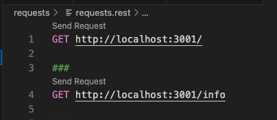

## Full Stack Open Source
### Part 3 - Phonebook Backend

Site deployed at https://fullstack-phonebook-backend-t3m8.onrender.com/

### Exercises 3.1 to 3.8 (Part 3a)

*This program is the backend for a rudimentary phonebook app with a field for filtering by name, a form for entering names and phone numbers, and a display of the people matching the search term or if that field is empty, a display of all people.  When displayed, each person has a delete button shown to remove them from the phonebook.*

A backend built on top of NodeJs.  Used npm init to create a template.  The entry point is index.js.  I added `"start": "node index.js",` in the scripts section of package.json.  Now `npm start` will run the program in index.js file.

index.js becomes a web server to serve raw json data to our frontend phonebook application.

Express is a library that is more pleasing to use than Node's built-in http web server.  Express is added as a dependency with `npm install express` and it is added to our package.json file.

To start the project on another computer, type `npm install`.  Updating all the dependencies can be done with `npm update`.

At the beginning of the code, we're importing express, which this time is a function that is used to create an express application stored in the app variable.
```js
const express = require('express')
const app = express()
```
Routes to the express application are defined using http methods on app, such as app.get() and app.post().  Here is an example of a get request to the endpoint `/api/notes`
```js
app.get('/api/notes', (request, response) => {
  response.json(notes)
})
```

Changing the code of the application requires stopping the application with Control-C, then restarting it to see the changes.  nodemon is a package that will automatically restart the application if our code changes.
`npm install --save-dev nodemon` adds nodemon as a dependency in just our development environment.

Adding `"dev": "nodemon index.js",` to the scripts section of package.json will allow us to start the application with `npm run dev`. ('run' has to be added because it is a non-native script like 'start' or 'test')

Making our application behave like a REST api, we will follow the uniform interface of creating unique identifiers for our resourses by combining our base url with the name of the resource as well as the resources unique identifier, for example `www.example.com/api/notes/10` where the base url is www.example.com/api and we are defining the url for note #10.  Then we can use the http methods (or verbs) get, post, delete, etc to interact with our RESTful api.

Now in our routes, we use colon syntax to indicate the unique identifier of a resource.  For example,
```js
app.get('/api/notes/:id', (request, response) => {
  const id = request.params.id
  const note = notes.find(note => note.id === id)
  response.json(note)
})
```

Postman is a common tool for testing backends.  But I have struggled using it on my Mac.  Instead, I will use VSCode's REST client plugin.  To work, add a directory named 'requests' at the root folder, then the client requests will be files with *.rest* extension.  Multiple requests can be in one .rest file using `###` separators.  For example,\


Exercises 3.1 to 3.6
Create a backend that returns a hardcoded list of phonebook entries at route `api/persons`
The application can be started with `npm start` and also contains `npm run dev` that will restart the application when the code changes.
Route `/info` returns the number of people in the current phonebook and the timestamp of when the request was made.
Route `/api/persons/5` displays a single phonebook entry.
A delete request to `/api/persons/5` deletes a single phonebook entry.
A post request to `/api/persons` creates a new phonebook entry with an id generated with Math.random.
Create error handling for for new entries that responds with an appropriate error message

Middleware are functions that can be used for handling request and response objects.  More than one can be used at a time.  They have three parameters: response, request, and next.  The next parameter is a function that yields control to the next middleware.  Middleware is taken into use as follows: `app.use(middlewareName)` and called in the order they are used in the code.  The express middleware json-parser was used in the above exercises to parse JSON data into javascript objects.  It was taken into use with `app.use(express.json())`.  In the below exercises a different middleware will be added.

Exercises 3.7 and 3.8
Add the middleware `morgan` for logging.  It is added as a dependency with `npm install morgan`.  Have morgan log using the tiny configuration.  Then also log the data sent in http post requests.

### Exercises 3.9 to 3.11 (Part 3b)

Exercise 3.9
Have the phonebook front end get data from the phonebook backend instead of using json-server.  The main steps were:
1. Adding cors middleware to the backend index.js file
2. Updating the frontend personService baseUrl to match the backend endpoint

Exercise 3.10 and 3.11
Deploy the phonebook project to Render.  The main steps were:
1. Updating the PORT constant to read from Render's environmental variable
`const PORT = process.env.PORT || 3001`
2. Making the frontend personService baseUrl relative to backend folder
3. Creating a production build of our front end
4. Add a copy of our frontend production build folder to the backend folder
5. Adding express.static middleware so our backend can deploy a static site
6. Creating a new Web Service on Render with our backend github repository
Deployed site is located at https://fullstack-phonebook-backend-t3m8.onrender.com/

Exercise 3.12
Create a cloud-based MongoDB database for the phonebook application with MongoDB Atlas.
1. Create a new Project at my MongoDB Atlas account named 'fullstack-phonebook'
2. Create a new Cluster called 'fullstack-phonebook' with username and password

Create a mongo.js file in the project directory, that can be used for adding entries to the phonebook, and for listing all of the existing entries in the phonebook using command line commands.
1. Code for connecting to the database
2. Code for using command-line arguments to add a new person to the database
    `node mongo.js <password> <name> <number>`
3. Code for displaying all data if just password is given as a command-line argument
    `node mongo.js <password>`
